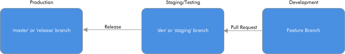

# Eigen X: Coding Standards and Style Guides
A guide for preferred coding standards and styles at Eigen X.

## Contents

1. [Agile Developer Mindset](#agile)
1. [Deployment Guidelines](#deployment)
1. [Versioning and Source Control Guidelines](#versioning)
1. [Style Guide](#style)
1. [IDE's and Code Editors](#ide)
1. [Testing Guidelines](#testing)
1. [Definition of Done](#definition-of-done)
1. [Contributing](#contributing)

# Agile

Agile development is not a process, it is a mindset. It's important to note that developers should use their discretion when implementing this guide based on the individual project. For small projects it is prudent to avoid unnecessary overhead, for large projects this repo may need to be forked and adapted to that project as a deliverable.

> Individuals and interactions over processes and tools

Favor collaboration and code reviews on Pull Requests over mandating ide's and excessive tooling.

> Working software over comprehensive documentation

Favor meeting requirements over excessive

> Customer collaboration over contract negotiation

Our goal is to provide the most value within the scope of our projects. We need to be in constant contact with our customers to focus on what is important to them.

> Responding to change over following a plan

Tech changes quickly, we should use tech that is appropriate for the project at hand. Favor good tech over old habits.

* Quotes from the [Agile Manifesto](http://agilemanifesto.org/)*

# Versioning
In all projects there needs to be a reliable method of source/version control. [git](https://git-scm.com/) is the preferred tool.

## General Branching Strategy

**Branches:**
- `master`/`release`: This is the live or production version of the code. The single source of truth for the most up-to-date code.
- `dev`/`staging`: This is the staging version of the code. Testing of new features should be done here prior to a release to `master`/`release` branch.
- `feature`: This branch should be where development takes place. Branch can be for individual developers or issues/bugs/features. Sometimes if the feature is big there will have to be subbranches merging into this. Naming isn't as important as long as the `pull request` to `dev`/`staging` includes the appropriate ticket number.

**Actions:**
- `release`: When code in the `dev`/`staging` branch is accepted, a version number should be assigned and the code should be merged to `master`/`release`
- `pull request`: In most cases there should be one pull request for a coinciding `bug` resolution, `feature` add, or `requirement` fulfillment. The pull request should reference the appropriate issue and should include the ticket number in the name of the Pull Request.

### Salesforce Specific Source Control
Salesforce often uses Production as the source of truth, which can be problematic. In which case see the `Source Code Management` section of [Software Development in Salesforce](https://www.linkedin.com/pulse/software-development-salesforce-tuan-lu/).

## Git Repo Hosting
One of the following should be used:
- GitHub
- BitBucket

# Deployment
In general, it is good practice to deploy from your `master`/`release` branch to your production server. Ideally, each release should contain a list of actions needed to deploy.

## Salesforce Specific
Salesforce uses change sets to move code between environments rather then deploying from source. In this case see the `Deployment` section of [Software Development in Salesforce](https://www.linkedin.com/pulse/software-development-salesforce-tuan-lu/).

# Style
Style and coding standards will vary based on language/library conventions.

1. `Apex`
    - **Style Guide:** [PMD Apex Rule Sets](https://pmd.github.io/pmd-5.5.7/pmd-apex/rules/index.html). If applicable, `Java` conventions should be followed where there is no guidance specific to `Apex`.
    - **Dev Tools:**
        - [PMD](https://pmd.github.io/) can be used with [apex](https://github.com/pmd/pmd/tree/master/pmd-apex).
1. `CSS/Sass`
    - **Style Guide:** [Airbnb CSS / Sass Styleguide](https://github.com/airbnb/css)
    - **Dev Tools:**
        - Use [sass-lint](https://github.com/sasstools/sass-lint) with the [airbnb config](https://github.com/airbnb/css)
1. `HTML`
    - You should be writing Valid HTML according to the [living standard](https://html.spec.whatwg.org/)
    - **Dev Tools:** 
        - [W3 HTML Validation](https://validator.w3.org/nu/) you can also use [a command-line version of this](https://github.com/zrrrzzt/html-validator-cli)
        - [Accessibility Testing](https://allyjs.io/)
1. `Java`
    - **Style Guide:** [Google Java Style Guide](https://google.github.io/styleguide/javaguide.html)
    - **Dev Tools:**
        - [PMD](https://pmd.github.io/)
1. `Javascript`
    - **Style Guide:** [AirBnB Javascript Style Guide](https://github.com/airbnb/javascript)
    - **Dev Tools:**
        - [ES Lint](https://eslint.org/)
1. `Python`
    - **Style Guide:** [PEP 8](https://www.python.org/dev/peps/pep-0008/)
    - **Dev Tools:**
        - [Pylint](https://www.pylint.org/)
1. `Salesforce Lightning`
    - **General Guidelines:**
        - [Thinking in Lightning](https://medium.com/eigen-x/thinking-in-lightning-f96b5dbf0a55)
1. `Shell Scripting`
    - **Style Guide:** [Google Shell Style Guide](https://google.github.io/styleguide/shell.xml)
1. `VisualForce`
    - **Style Guide:** [PMD Apex Rule Sets](https://pmd.github.io/pmd-5.5.7/pmd-apex/rules/index.html). If applicable, `Javascript/HTML/CSS` conventions should be followed where there is no guidance specific to `VisualForce`.
    - **Dev Tools:**
        - [PMD](https://pmd.github.io/) can be used with [VisualForce](https://github.com/pmd/pmd/tree/master/pmd-visualforce).

# IDE
Developers should use tools they are comfortable with. No standard IDE will be mandated on a project because it is a distraction from productivity. Related: [What Editor Do you Use?](https://medium.com/humans-create-software/what-editor-do-you-use-fun-fun-function-31-cab6d2e61a25)

## Suggested Editors/IDEs

Some of the editors our devs use include: 
- [Atom](https://atom.io/)
- [Eclipse](http://www.eclipse.org/downloads/packages/)
- [Intellij](https://www.jetbrains.com/idea/)
- [Sublime](https://www.sublimetext.com/3)
- [Vim](https://www.vim.org/)
- [VS Code](https://code.visualstudio.com/Vim)

# Testing
Testing Strategies should be determined on a per project basis.

General Guidelines:
- [A Realistic Approach to Software Testing on the Software Platform](https://medium.com/eigen-x/a-realistic-approach-to-software-testing-on-the-salesforce-platform-7df39c34162b)
- [Commonly Made Mistakes When Testing Software on the Salesforce Platform](https://medium.com/eigen-x/commonly-made-mistakes-when-testing-software-on-the-salesforce-platform-ad38cf32d173
)
- [Test Pyramid](https://martinfowler.com/bliki/TestPyramid.html)
- [Given When Then](https://martinfowler.com/bliki/GivenWhenThen.html)

# Definition of Done
Definitions of done should be determined on a per project basis.

A 'definition of done' is consistent requirements cross all user stories. Example: Accessibility Testing

# Contributing
There are two main branches:
1. `master` - a release branch that should be considered active and in use.
2. `proposal` - a staging branch for all proposed changes.

If you have would like to contribute or have a suggestion for this style guide, please submit them by making a pull request into the `proposal` branch.
